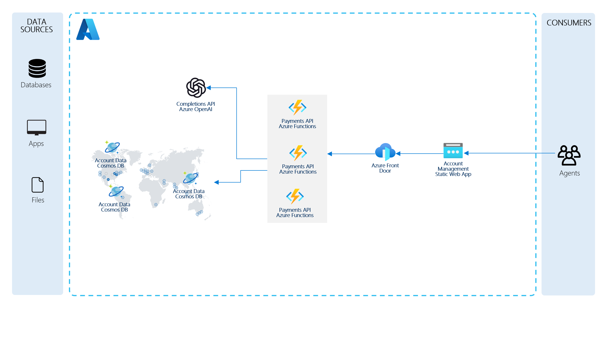
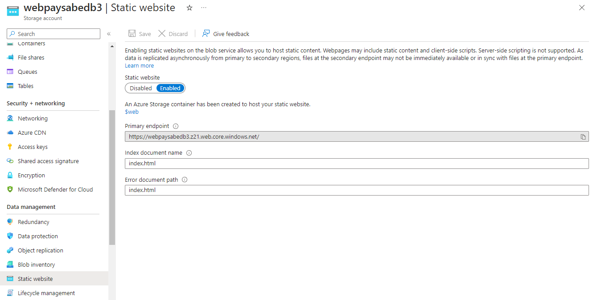

# Azure Cosmos DB NoSQL API & Azure OpenAI Service - Payment & Transaction Processing

## Introduction

This repository provides a code sample in .NET on how you might use a combination of Azure Functions, Azure Cosmos DB, Azure OpenAI Service and Azure Event Hubs to implement a payment tracking process.

## Scenario

The scenario centers around a payments and transactions solution. Members having accounts, each account with corresponding balances, overdraft limits and credit/debit transactions. 

Transaction data is replicated across multiple geographic regions for both reads and writes, while maintaining consistency. Updates are made efficiently with the patch operation.

Business rules govern if a transaction is allowed. 

An AI powered co-pilot enables agents to analyze transactions using natural language.

## Solution Architecture

The solution architecture is represented by this diagram:

<p align="center">
    
</p>

## Deployment

Check the [Deployment](./docs/deployment.md) page for instructions on how to deploy the solution to your Azure subscription.

Once your deployment is complete, you can proceed to the [Quickstart](#quickstart) section.

### Publish the React web app after making changes

If you make changes to the React web app and want to redeploy it, run the following from the `deploy/powershell` folder:

```pwsh
./Publish-Site.ps1 -resourceGroup <resource-group-name> `
                   -storageAccount <storage-account-name (webpayxxxx)>
```

### Setting RBAC permissions when running locally

When you run the solution locally, you will need to set role-based access control (RBAC) permissions on the Azure Cosmos DB account. You can do this by running the following commands in the Azure Cloud Shell or Azure CLI:

Assign yourself to the "Cosmos DB Built-in Data Contributor" role:

```bash
az cosmosdb sql role assignment create --account-name YOUR_COSMOS_DB_ACCOUNT_NAME --resource-group YOUR_RESOURCE_GROUP_NAME --scope "/" --principal-id YOUR_AZURE_AD_PRINCIPAL_ID --role-definition-id 00000000-0000-0000-0000-000000000002
```

> Make sure you're signed in to Azure from Visual Studio before running the backend applications locally.

## Quickstart

### Generate sample data

1. After deployment is complete, navigate to where you cloned the repo and open the `\src\CorePayments.sln` solution file in Visual Studio.
   1. If you did not deploy from your machine, go to the resource group for your deployment and open the Azure Cosmos DB account.
   1. Select `Keys` in the left-hand navigation pane and copy the `PRIMARY CONNECTION STRING` value.
1. On your local machine, navigate to where you cloned the repo and open the `\src\CorePayments.sln` solution file in Visual Studio.
1. Expand the **account-generator** project and open the `local.settings.json` file to verify that the `CosmosDbConnectionString` value is populated. If the file does not exist, copy the `local.settings.template.json` file and rename it to `local.settings.json`. Paste the connection string value into the `CosmosDbConnectionString` field.
1. Right-click on the **account-generator** project and select `Debug` > `Start new instance` to run the project.
1. It will take several minutes to generate the sample data. You can monitor the progress in the console window.

Please note that you can modify the generator options within the `local.settings.json` file. The following options are available:

| Option | Value(s) | Description |
|--------|-------------|----------|
| `RunMode` | `OneTime` or `Continuous` | If set to `OneTime` (default), the generator will generate the number of transactions specified by the BatchSize value. The `Continuous` mode will run until the console application is closed or interrupted with a Ctrl+C command. |
| `BatchSize` | Any integer value (default is `100`) | Refers to how many account summaries to generate within each series of 5 batches (eg. 5 batches * 200 batch size = 1000 new records) when RunModeOption is set to `OneTime`. |
| `SleepTime` | Any integer value (default is `10000`) | Refers to the delay in milliseconds between each batch of transactions. |
| `Verbose` | `true` or `false` (default is `true`) | Sets the console logging level. |

### Access the web app

1. After deployment is complete, go to the resource group for your deployment and open the Azure Storage Account prefixed with `web`.  This is the storage account hosting the static web app.
1. Select the `Static website` blade in the left-hand navigation pane and copy the site URL from the `Primary endpoint` field in the detail view.

    <p align="center">
        
    </p>

1. Browse to the URL copied in the previous step to access the web app.
