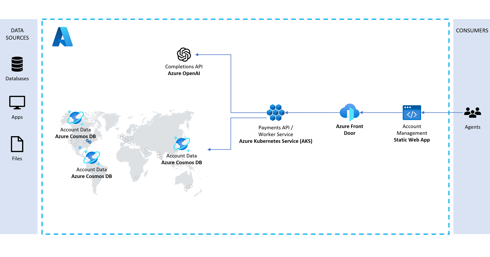

# Cosmos DB NoSQL API - Payments

## Introduction

This repository provides a code sample in .NET on how you might use a combination of Azure Functions, Cosmos DB, OpenAI and EventHub to implement a payment tracking process.

## Scenario

The scenario centers around a payments and transactions solution. Members having accounts, each account with corresponding balances, overdraft limits and credit/debit transactions. 

Transaction data is replicated across multiple geographic regions for both reads and writes, while maintaining consistency. Updates are made efficiently with the patch operation.

Business rules govern if a transaction is allowed. 

An AI powered co-pilot enables agents to analyze transactions using natural language.

## Solution Architecture

The solution architecture is represented by this diagram:

<p align="center">
    
</p>

## Deployment

### Prerequisites

- Powershell
- Azure CLI 2.49.0 or greater
- Azure Subscription
- Subscription access to Azure OpenAI service. Start here to [Request Access to Azure OpenAI Service](https://customervoice.microsoft.com/Pages/ResponsePage.aspx?id=v4j5cvGGr0GRqy180BHbR7en2Ais5pxKtso_Pz4b1_xUOFA5Qk1UWDRBMjg0WFhPMkIzTzhKQ1dWNyQlQCN0PWcu)

### Prerequisites for running/debugging locally

- Backend (Web API, Console Apps, etc.)
  - Visual Studio 2022 17.6 or later (required for passthrough Visual Studio authentication for the Docker container)
  - .NET 7 SDK
- Frontend (React web app)
  - Visual Studio Code
  - Ensure you have the latest version of NPM and node.js:
    - Install NVM from https://github.com/coreybutler/nvm-windows
    - Run nvm install latest
    - Run nvm list (to see the versions of NPM/node.js available)
    - Run nvm use latest (to use the latest available version)

To start the React web app:

1. Navigate to the `ui` folder
2. Run npm install to restore the packages
3. Run npm run dev
4. Open localhost:3000 in a web browser

#### Running the backend locally

- Since the app uses role-based access control (RBAC), if you want to run the Web API and Worker Service locally, you have to assign yourself to the "Cosmos DB Built-in Data Contributor" role via the Azure Cloud Shell or Azure CLI with the following:

    ```bash
    az cosmosdb sql role assignment create --account-name YOUR_COSMOS_DB_ACCOUNT_NAME --resource-group YOUR_RESOURCE_GROUP_NAME --scope "/" --principal-id YOUR_AZURE_AD_PRINCIPAL_ID --role-definition-id 00000000-0000-0000-0000-000000000002
    ```

    > Make sure you're signed in to Azure from the Visual Studio before running the backend applications locally.

### Standard Deployments

#### Clone the Repo

You will need the files locally when performing standard deployments. To start, clone the repo.

> **Important:** Do not forget the `--recurse-submodules` parameter. This loads the `AKS-Construction` submodule that contains AKS-specific Bicep templates.

```bash
git clone --recurse-submodules https://github.com/AzureCosmosDB/RealTimeTransactions.git
```

#### Execute PowerShell Script

From the `deploy/powershell` folder, run the following command. This should provision all of the necessary infrastructure, deploy builds to the function apps, deploy the frontend, and deploy necessary artifacts to the Synapse workspace.

```pwsh
.\Unified-Deploy.ps1 -resourceGroup <resource-group-name> `
                     -subscription <subscription-id>
```

### Cloud Shell Based Deployments

Create a cloud shell environment in a tenant that contains the target subscription.  Clone the repository and then execute the `CloudShell-Deploy.ps1` script as illustrated in the following snippet.  This will provision all of the required infrastructure and deploy the API and web app services into AKS.

```pwsh
git clone https://github.com/hatboyzero/RealTimeTransactions.git
cd RealTimeTransactions
chmod +x ./deploy/powershell/*
./deploy/powershell/CloudShell-Deploy.ps1 -resourceGroup <rg-name> `
                                          -subscription <target-subscription>
```

### Azure VM Based Deployments

Run the following script to provision a development VM with Visual Studio 2022 Community and required dependencies preinstalled.

```pwsh
.\deploy\powershell\Deploy-Vm.ps1 -resourceGroup <rg-name> -location EastUS
```

When the script completes, the console output should display the name of the provisioned VM similar to the following:

```
The resource prefix used in deployment is libxarwttxjde
The deployed VM name used in deployment is libxarwttxjdevm
```

Use RDP to remote into the freshly provisioned VM with the username `BYDtoChatGPTUser` and password `Test123456789!`.  Open up a powershell terminal and run the following script to provision the infrastructure and deploy the API and frontend. This will provision all of the required infrastructure, deploy the API and web app services into AKS, and import data into Cosmos.

```pwsh
git clone https://github.com/hatboyzero/PaymentsProcessing.git
cd PaymentsProcessing
./deploy/powershell/Unified-Deploy.ps1 -resourceGroup <rg-name> `
                                       -location EastUS `
                                       -subscription <target-subscription>
```

### Publish the React web app after making changes

If you make changes to the React web app and want to redeploy it, run the following from the `deploy/powershell` folder:


```pwsh
./Publish-Site.ps1 -resourceGroup <resource-group-name> `
                   -storageAccount <storage-account-name (webpayxxxx)>
```

### Enabling/Disabling Deployment Steps

The following flags can be used to enable/disable specific deployment steps in the `Unified-Deploy.ps1` script.

| Parameter Name | Description |
|----------------|-------------|
| stepDeployBicep | Enables or disables the provisioning of resources in Azure via Bicep templates (located in `./infrastructure`). Valid values are 0 (Disabled) and 1 (Enabled). See the `deploy/powershell/Deploy-Bicep.ps1` script.
| stepBuildPush | Enables or disables the build and push of Docker images into the Azure Container Registry (ACR). Valid values are 0 (Disabled) and 1 (Enabled). See the `deploy/infrastructure/BuildPush.ps1` script.
| stepDeployFD | Enables or disables deploying Azure Front Door. Valid values are 0 (Disabled) and 1 (Enabled). See the `deploy/infrastructure/Deploy-FDOrigins.ps1` script.
| stepDeployImages | Enables or disables deploying the Docker images from the `CoreClaims.WebAPI` and `CoreClaims.WorkerService` projects to AKS. Valid values are 0 (Disabled) and 1 (Enabled). See the `deploy/infrastructure/Deploy-Images-Aks.ps1` script.
| stepPublishSite | Enables or disables the build and deployment of the static HTML site to the hosting storage account in the target resource group. Valid values are 0 (Disabled) and 1 (Enabled). See the `deploy/infrastructure/Publish-Site.ps1` script.
| stepLoginAzure | Enables or disables interactive Azure login. If disabled, the deployment assumes that the current Azure CLI session is valid. Valid values are 0 (Disabled).

Example command:
```pwsh
cd deploy/powershell
./Unified-Deploy.ps1 -resourceGroup myRg `
                     -subscription 0000... `
                     -stepLoginAzure 0 `
                     -stepDeployBicep 0 `
                     -stepDeployFD 0 `
                     -stepBuildPush 1 `
                     -stepDeployImages 1 `
                     -stepPublishSite 1
```

### Quickstart

#### Generate sample data

1. After deployment is complete, navigate to where you cloned the repo and open the `\src\CorePayments.sln` solution file in Visual Studio.
   1. If you did not deploy from your machine, go to the resource group for your deployment and open the Azure Cosmos DB account.
   1. Select `Keys` in the left-hand navigation pane and copy the `PRIMARY CONNECTION STRING` value.
1. On your local machine, navigate to where you cloned the repo and open the `\src\CorePayments.sln` solution file in Visual Studio.
1. Expand the **account-generator** project and open the `local.settings.json` file to verify that the `CosmosDbConnectionString` value is populated. If the file does not exist, copy the `local.settings.template.json` file and rename it to `local.settings.json`. Paste the connection string value into the `CosmosDbConnectionString` field.
1. Right-click on the **account-generator** project and select `Debug` > `Start new instance` to run the project.
1. It will take several minutes to generate the sample data. You can monitor the progress in the console window.

Please note that you can modify the generator options within the `local.settings.json` file. The following options are available:

| Option | Value(s) | Description |
|--------|-------------|----------|
| `RunMode` | `OneTime` or `Continuous` | If set to `OneTime` (default), the generator will generate the number of transactions specified by the BatchSize value. The `Continuous` mode will run until the console application is closed or interrupted with a Ctrl+C command. |
| `BatchSize` | Any integer value (default is `100`) | Refers to how many account summaries to generate within each series of 5 batches (eg. 5 batches * 200 batch size = 1000 new records) when RunModeOption is set to `OneTime`. |
| `SleepTime` | Any integer value (default is `10000`) | Refers to the delay in milliseconds between each batch of transactions. |
| `Verbose` | `true` or `false` (default is `true`) | Sets the console logging level. |

#### Access the web app

1. After deployment is complete, go to the resource group for your deployment and open the Azure Storage Account prefixed with `web`.  This is the storage account hosting the static web app.
1. Select the `Static website` blade in the left-hand navigation pane and copy the site URL from the `Primary endpoint` field in the detail view.

    <p align="center">
        
    </p>

1. Browse to the URL copied in the previous step to access the web app.
